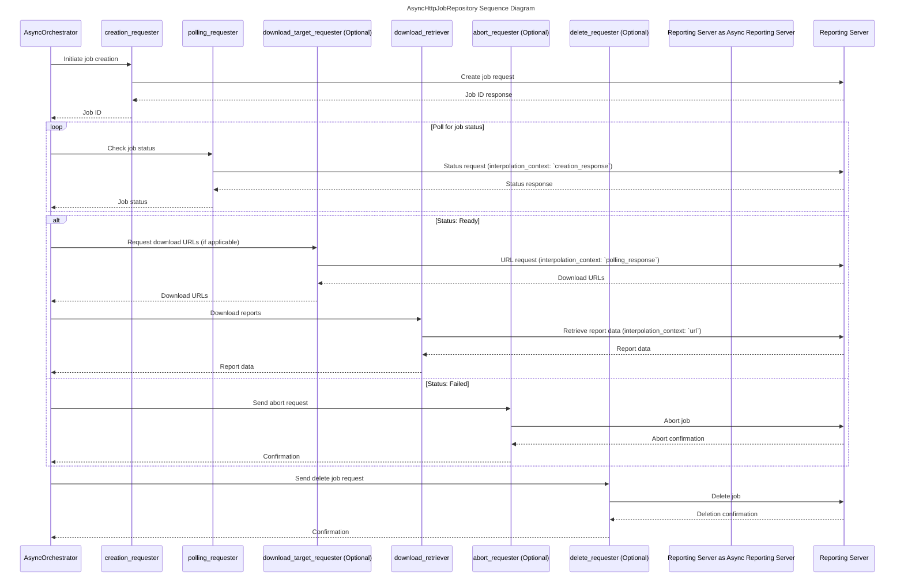

# AsyncHttpJobRepository sequence diagram

- Components marked as optional are not required and can be ignored.
- if `download_target_requester` is not provided, `download_target_extractor` will get urls from the `polling_response`
- interpolation_context, e.g. `creation_response` or `polling_response` can be obtained from stream_slice

